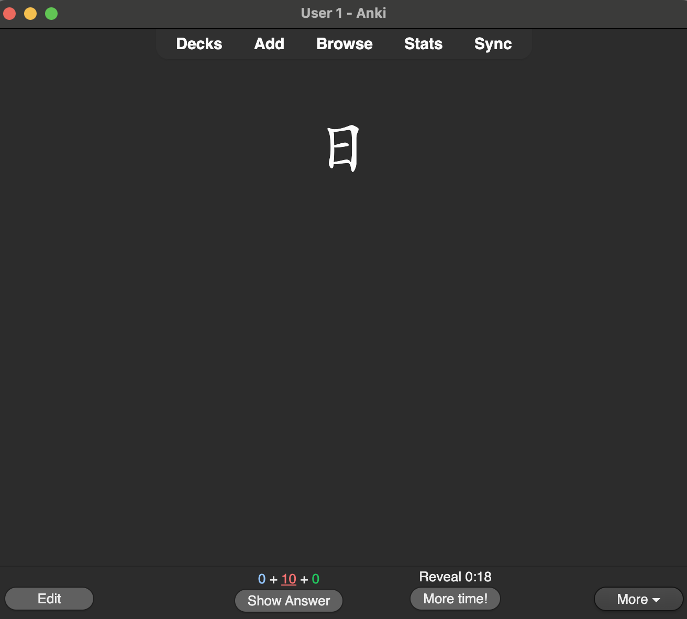
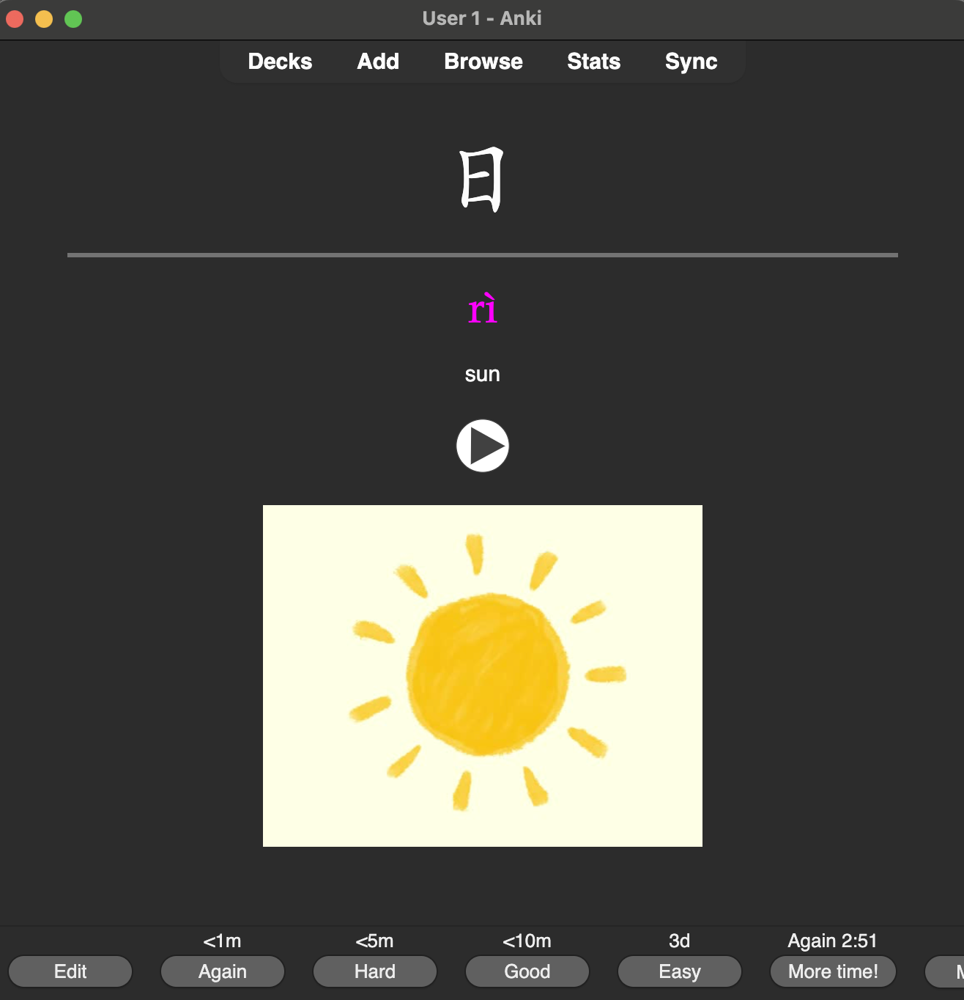

# UCD HSK Anki Deck

I started UCD's HSK 1.1 class on October 2024 and wanted a better way to memorize the vocab learned in classes.
This repository contains the code needed to generate an Anki deck programatically.

The program is fed the `data.json` file to do its work.

Images and sound assets are not included with this repository because copyright (even though they are inside the deck package, meh).

## How do I use this?

My main goal with learning Chinese is to be able to read, so the cards emphasize that.

The front of the card has the word (or sentence) written in Chinese characters:

The back of the card shows you the reading (pinyin), the meaning, and an audio file so you can hear it. 

Most cards have an image included to help associate the character with the meaning.

## How do I get the Anki deck?

Head to the [releases page](https://github.com/ltadeut/ucd-hsk-anki-deck/releases/latest) to get the latest version.

You'll want to download the file ending in `.apkg`. That's the Anki package containing the deck.

Once you have the file it's just a matter of importing the deck.

## Caveats

### Pinyin

Pinyin is mostly generated by some code I wrote. It's not always 100% correct (it tries to match the text with the longest sequence in a dictionary).
I've done a couple of passes over it and seems that it's correct but ymmv.

Use that to check your knowledge ;)
